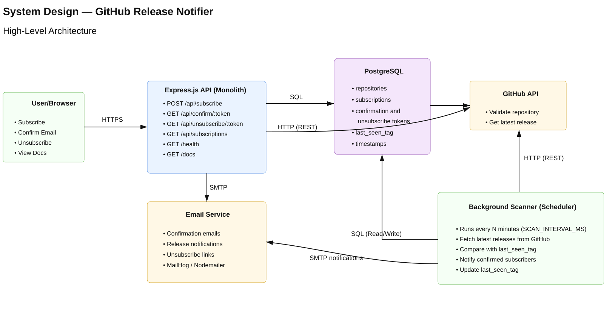

# GitHub Release Notifier


GitHub Release Notifier is a Node.js application for subscribing to email
notifications about new GitHub repository releases. A user subscribes with an
email and repository name, confirms the subscription by email, and then receives
release notifications when the tracked repository publishes a new tag.

The project started as a REST API and was gradually extended with a modular
architecture, a separate notification service, RabbitMQ messaging, an
orchestrated Saga, gRPC delivery, observability, and architecture boundary tests.

## Architecture



The system is built around two runtime services:

- **Main application**: owns public HTTP API, subscription state, repository
  tracking, release scanning, Saga orchestration, Swagger docs, metrics, and the
  static UI.
- **Notification service**: owns email delivery, SMTP/Nodemailer integration,
  REST and gRPC notification endpoints, and RabbitMQ command consumption.

PostgreSQL is the source of truth for subscriptions, repositories, release
history, processed messages, and Saga state. RabbitMQ is used for asynchronous
release notification commands with retry and dead-letter queues. Subscription
confirmation uses synchronous gRPC because the Saga orchestrator needs an
immediate delivery result.

## What Is Implemented

### Product Flow

- Subscribe to GitHub release notifications by `email + owner/repo`.
- Validate email format and GitHub repository format.
- Verify repository existence through the GitHub REST API.
- Store subscriptions as pending until email confirmation.
- Send confirmation emails through the notification service.
- Confirm and unsubscribe with secure random tokens.
- List active subscriptions by email.
- Periodically scan tracked repositories for new releases.
- Send release notification emails only to confirmed subscribers.

### Architecture and Reliability

- Modular main application with public module APIs.
- Separate notification service for email delivery.
- PostgreSQL migrations and transactional data access.
- Orchestrated Saga for subscription confirmation.
- Saga timeout recovery and compensation for failed delivery.
- RabbitMQ topology with durable queues, retry queues, and DLQs.
- Idempotent message handling through `processed_messages`.
- gRPC notification delivery with a protobuf contract.
- REST notification endpoint kept as a benchmark/reference baseline.
- Graceful shutdown and reconnect logic for broker consumers.
- Architecture dependency tests to protect module boundaries.

### Observability

- Structured JSON logs with request IDs.
- Prometheus metrics exposed through `/metrics`.
- HTTP RED metrics for request rate, errors, and duration.
- Release scanner metrics for runs, duration, sent emails, and repository
  failures.
- Docker Compose stack for Prometheus, Grafana, Logstash, Elasticsearch, and
  Kibana.

## Tech Stack

| Area | Technology |
|---|---|
| Runtime | Node.js, ESM |
| HTTP API | Express |
| API Docs | Swagger UI, `swagger.yaml` |
| Database | PostgreSQL, `pg`, SQL migrations |
| Messaging | RabbitMQ, durable queues, retry/DLQ topology |
| Service Communication | gRPC over HTTP/2 with ConnectRPC |
| Contract | Protobuf, Buf |
| Email | Nodemailer, SMTP/MailHog for local development |
| Observability | Prometheus, Grafana, ELK stack, structured logs |
| Tests | Vitest, Supertest, Docker-based integration tests, Playwright E2E |
| Tooling | ESLint, Docker Compose |

## Local Setup

### Prerequisites

- Node.js 20+
- Docker Desktop / Docker Compose

### Run with Docker Compose

```bash
cp .env.example .env
```

Set `SAGA_API_TOKEN` in `.env` before starting the stack. The Docker Compose
configuration intentionally refuses to start the main app without this token.

```bash
docker compose up --build
```

Useful local URLs:

| Service | URL |
|---|---|
| Main app | `http://localhost:3000` |
| Swagger UI | `http://localhost:3000/docs` |
| Notification REST API | `http://localhost:3002` |
| Notification gRPC | `http://localhost:3003` |
| MailHog UI | `http://localhost:8025` |
| RabbitMQ Management | `http://localhost:15672` |
| Prometheus | `http://localhost:9090` |
| Grafana | `http://localhost:3001` |
| Kibana | `http://localhost:5601` |

The notification service REST and gRPC ports are published to the host for local
debugging and benchmarking only. They are internal service-to-service APIs and
should not be exposed publicly in a real deployment without authentication or
network isolation.

## API

Main REST API:

| Method | Endpoint | Purpose |
|---|---|---|
| `GET` | `/health` | Basic health check |
| `GET` | `/health/live` | Liveness check |
| `GET` | `/health/ready` | Readiness check |
| `GET` | `/metrics` | Prometheus metrics |
| `POST` | `/api/subscribe` | Create a pending subscription |
| `GET` | `/api/confirm/:token` | Confirm subscription |
| `GET` | `/api/unsubscribe/:token` | Unsubscribe |
| `GET` | `/api/subscriptions?email=...` | List active subscriptions |
| `GET` | `/api/sagas` | List Saga records |
| `GET` | `/api/sagas/:id` | Inspect one Saga |

Saga monitoring endpoints require `x-saga-api-token` or `Authorization: Bearer`
with the value from `SAGA_API_TOKEN`. If `SAGA_API_TOKEN` is unset outside
Docker Compose, the Saga endpoints run without authentication, so this variable
should be set for any shared environment.

Notification service:

| Transport | Endpoint / RPC | Purpose |
|---|---|---|
| REST | `POST /api/notifications/subscription-confirmation` | REST baseline for confirmation delivery |
| gRPC | `NotificationService.SendSubscriptionConfirmation` | Production confirmation delivery |
| RabbitMQ | `notification.release.send` | Async release notification command |

The protobuf contract is defined in
[`proto/notification/v1/notification.proto`](proto/notification/v1/notification.proto).

## gRPC and Buf

Subscription confirmation delivery uses gRPC:

1. `POST /api/subscribe` creates a pending subscription and Saga record.
2. The Saga orchestrator calls `NotificationService.SendSubscriptionConfirmation`.
3. The notification service validates the request and sends the email.
4. The Saga is marked `COMPLETED` after a successful gRPC response.
5. If delivery definitely fails, the pending subscription is compensated. If
   the gRPC request times out, the subscription is not deleted because the email
   may already have been sent.

Check and regenerate protobuf output:

```bash
npm run proto:check
```

## Tests and Quality Checks

```bash
npm run lint
npm run test:unit
npm run test:integration
npm run test:e2e
npm run arch:check
```

What the checks cover:

- unit tests for services, repositories, controllers, consumers, metrics, and
  Saga behavior;
- Docker-based integration tests for API flows, RabbitMQ topology, PostgreSQL,
  and MailHog-backed email delivery;
- Playwright E2E tests for the browser flow;
- architecture dependency tests that prevent modules from importing each
  other's internals;
- protobuf lint and generation through Buf.

## REST vs gRPC Benchmark

The benchmark compares the previous REST notification delivery path with the new
gRPC path.

```bash
npm run benchmark:notification-transport
```

By default it uses local no-op handlers so the result focuses on transport
overhead instead of SMTP, templates, database I/O, or MailHog.

Example local result:

```text
REST: 1431.67 req/s
gRPC: 1244.47 req/s
gRPC/REST throughput ratio: 0.87x
```

For this tiny unary payload, REST can be slightly faster because HTTP/2 and
protobuf setup overhead is larger than the actual work. gRPC is still useful in
the service boundary because the contract is typed, status codes are explicit,
and the protocol scales better for richer internal APIs.

To benchmark the full running notification service:

```bash
BENCHMARK_TARGET=service npm run benchmark:notification-transport
```

## Documentation

| Document | Description |
|---|---|
| [System Design](docs/system-design.md) | High-level system design, flows, components, trade-offs |
| [Application Architecture](docs/application-architecture.md) | Layers, module boundaries, dependency rules |
| [Modular Architecture](docs/modular-architecture.md) | Modularization details and public APIs |
| [Logging](docs/logging.md) | Structured logging and ELK setup |
| [Metrics](docs/metrics.md) | Prometheus metrics and Grafana dashboards |
| [Notification Service](services/notification-service/README.md) | Separate service responsibilities and runtime behavior |

## Architecture Decisions

| ADR | Decision |
|---|---|
| [ADR-001](docs/adr/001-use-postgresql.md) | Use PostgreSQL as the primary datastore |
| [ADR-002](docs/adr/002-use-monolith-architecture.md) | Start with a monolith architecture |
| [ADR-003](docs/adr/003-use-email-confirmation.md) | Require email confirmation before notifications |
| [ADR-004](docs/adr/004-use-rabbitmq-for-notification-commands.md) | Use RabbitMQ for notification commands |
| [ADR-005](docs/adr/005-use-orchestrated-saga-for-subscription-confirmation.md) | Use an orchestrated Saga for subscription confirmation |
| [ADR-006](docs/adr/006-enforce-layered-module-boundaries.md) | Enforce layered module boundaries with tests |

## Project Notes

- Release notifications are asynchronous and remain RabbitMQ-based.
- Subscription confirmation is synchronous and uses gRPC because the Saga needs
  a direct success/failure result.
- The REST notification endpoint remains in the codebase as a comparison
  baseline for the gRPC homework and benchmark.
- The project is optimized for clarity and local reproducibility rather than
  production deployment automation.
