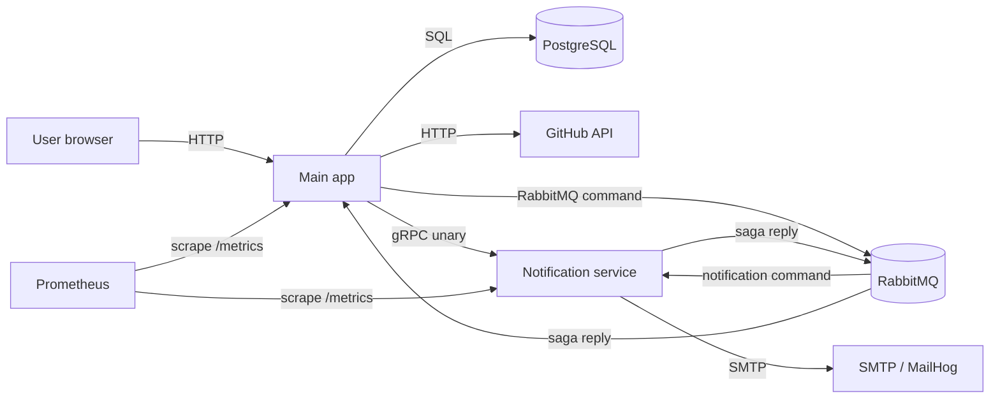
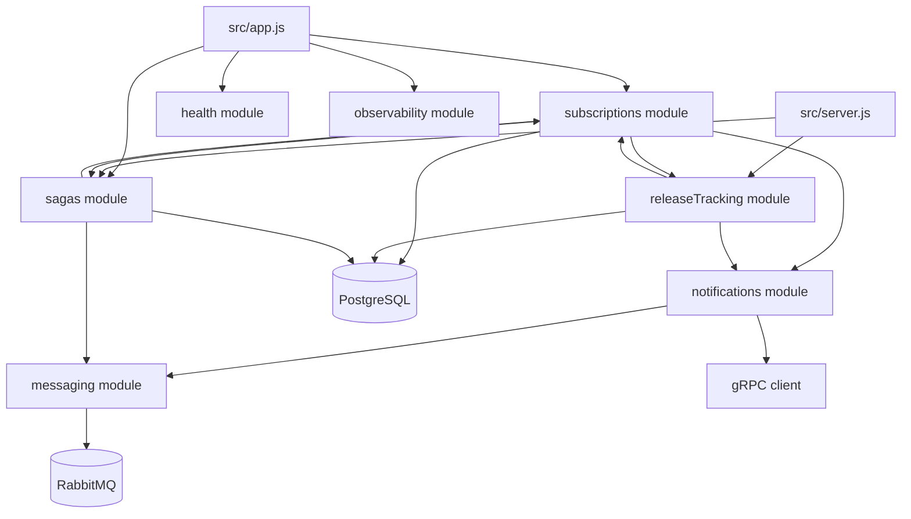
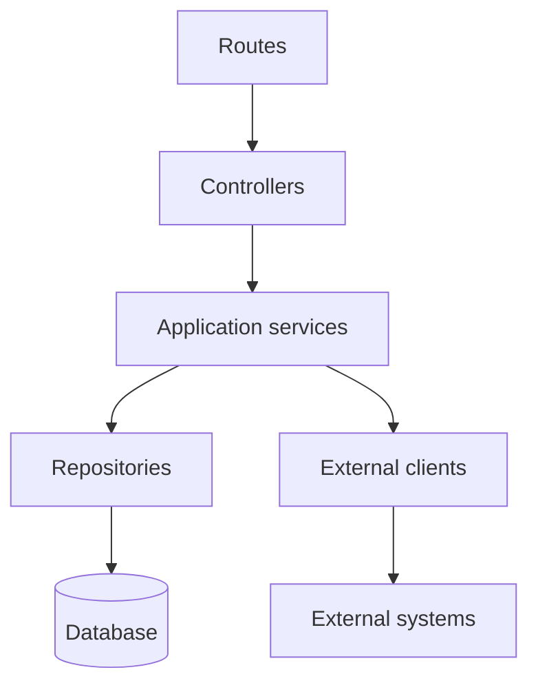
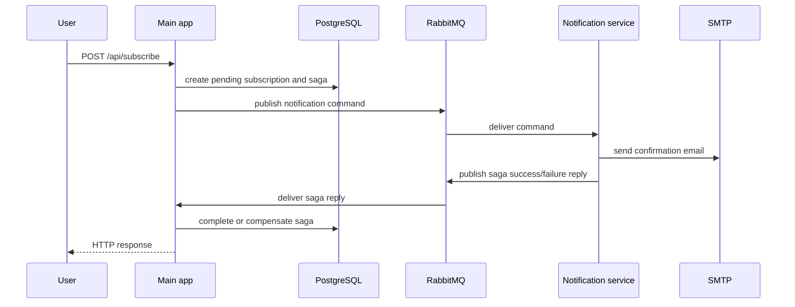
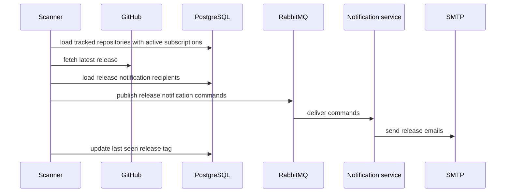

# Application Architecture

This document describes the current application architecture and the rules that
keep the codebase modular as the project grows.

## Context

GitHub Release Notifier lets users subscribe to release updates for GitHub
repositories. The system accepts subscriptions through HTTP, validates
repositories through the GitHub API, stores state in PostgreSQL, confirms email
ownership, scans repositories for new releases, and sends notifications.

The application is a modular Node.js system with one extracted notification
service:

- Main app: HTTP API, subscription lifecycle, repository tracking, release
  scanner, saga orchestration, metrics, logs.
- Notification service: email delivery over REST, gRPC, and RabbitMQ command
  consumption.
- PostgreSQL: persistent application state.
- RabbitMQ: asynchronous notification commands and saga replies.
- GitHub API: repository and release metadata.
- SMTP or MailHog: email transport.

## Runtime View



## Container Responsibilities

| Container | Responsibility | Owns |
|---|---|---|
| Main app | Public HTTP API, subscription workflow, release scanner, saga orchestration | subscriptions, repositories, sagas, metrics |
| Notification service | Email delivery and notification command processing | SMTP integration, email templates, processed message ids |
| PostgreSQL | Durable state | relational records and idempotency tables |
| RabbitMQ | Durable async communication | command queues, retry queues, dead-letter queues |
| Prometheus | Metrics collection | time-series metrics |
| Grafana/Kibana | Operational visibility | dashboards and log exploration |

## Module View



Cross-module imports must go through the target module public API:

```text
src/modules/<module>/index.js
```

This keeps each module free to reorganize internal files without breaking other
modules.

## Layering Rules

Each module follows the same dependency direction:



Rules:

| Layer | May depend on | Must not depend on |
|---|---|---|
| Routes | controllers, middleware | repositories |
| Controllers | application services, request errors | repositories, database clients |
| Services | repositories, clients, other modules through public APIs | Express |
| Repositories | database client, SQL helpers | services, controllers, routes |
| Clients | external transport libraries | controllers, repositories |
| Observability | shared logging and metrics primitives | business modules |

## Architecture Tests

The architecture rules are executable. The test
`tests/unit/architectureDependencies.unit.test.js` scans source imports and
fails when code breaks these boundaries.

It checks that:

- cross-module imports use `index.js`;
- routes and controllers do not import repositories directly;
- repositories do not import upper layers;
- services do not import Express.

Run it directly:

```bash
npm run arch:check
```

It is also included in:

```bash
npm run test:unit
```

## Important Flows

### Subscription Confirmation Through Saga



### Release Notification



## Reliability Notes

- RabbitMQ queues are durable and use retry and dead-letter queues.
- Publishers use confirm channels.
- Consumers acknowledge messages only after successful processing.
- Saga replies are idempotent through processed reply ids.
- Timed-out sagas are recovered by a periodic recovery job.
- Release scanning isolates failures per repository.
- Notification service exposes REST and gRPC. The main subscription saga uses
  gRPC for the synchronous service communication homework requirement.

## Boundaries Kept Intentionally

- The main app owns business state and saga decisions.
- The notification service owns email delivery.
- The messaging module owns RabbitMQ topology and broker clients.
- The observability module owns logging and metrics primitives.
- Modules may collaborate, but only through public APIs.
