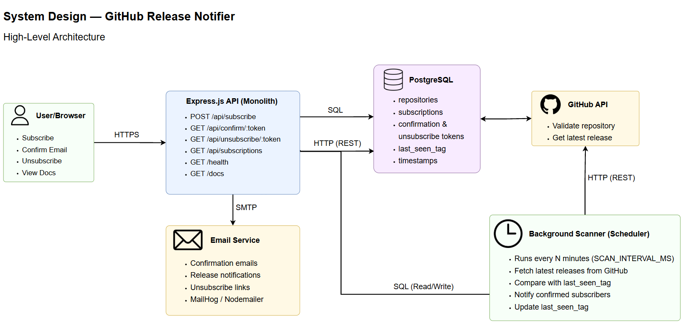

# System Design — GitHub Release Notifier

## 1. System Overview

GitHub Release Notifier is a Node.js web application that allows a user to subscribe an email address to release updates for a GitHub repository. The system validates repository existence through the GitHub API, stores subscriptions in PostgreSQL, requires email confirmation before activation, periodically checks repositories for new releases, and sends notification emails to confirmed subscribers.

The current implementation is a small monolithic Node.js service with Express, PostgreSQL, a background release scanner, SMTP-based email delivery, Swagger documentation, and a minimal static UI.

---

## 2. Goals and Requirements

### 2.1 Functional Requirements

The system must support:

- creating a subscription for an `email + owner/repo` pair;
- validating email format and GitHub repository format;
- checking that the GitHub repository exists;
- storing subscriptions as unconfirmed until the user confirms ownership of the email address;
- sending confirmation emails;
- confirming subscriptions through a confirmation token;
- unsubscribing through an unsubscribe token;
- listing subscriptions by email;
- periodically scanning GitHub repositories for the latest release;
- sending release notification emails when a new release tag appears;
- exposing a health check endpoint;
- exposing Swagger API documentation.

### 2.2 Non-Functional Requirements

| Requirement | Target / Design Choice |
|---|---|
| Availability | Service should remain available even if scanning one repository fails. Scanner errors are isolated per repository. |
| Consistency | PostgreSQL is the source of truth for repositories, subscriptions, tokens, confirmation status, and last seen release tags. |
| Security | Email confirmation is required before notifications are sent. Tokens are random and stored in the database. |
| Maintainability | Monolithic architecture keeps the project simple and easy to run locally. |
| Scalability | Current design supports the expected project workload. |
| Observability | Basic health check exists. |

---

## 3. Capacity and Load Estimation

The current system is designed for a small-to-medium workload.

### 3.1 Expected Usage

Assumptions:

- active users: up to 50,000;
- average subscriptions per user: 2–3;
- repositories tracked: much lower than subscriptions because many users may subscribe to the same repository;
- scan interval: 5 minutes by default;
- notification traffic: depends on how often repositories publish new releases.

### 3.2 Data Size

Approximate row sizes:

- repository row: `full_name`, owner/name, last seen tag, timestamps;
- subscription row: email, repository foreign key, confirmation/unsubscribe tokens, status fields, timestamps.

Even hundreds of thousands of subscriptions fit comfortably in PostgreSQL. The main bottleneck is not storage, but external API rate limits and email delivery throughput.

### 3.3 Network Usage

The application exchanges a relatively small amount of data.

Most requests contain only email addresses and repository names.
Outgoing traffic mainly consists of GitHub API requests and email notifications.

---

## High-Level Architecture



### Architecture Style

The accepted architecture is a monolith. This is appropriate because the project currently has one API, one database, one scanner, and one email-notification responsibility. It avoids the operational overhead of microservices while keeping the codebase easy to test and deploy.

---

## 5. Main Components

### 5.1 Static Web UI

The browser UI provides a simple subscription form with two fields:

- email;
- GitHub repository in `owner/repo` format.

The form sends a `POST /api/subscribe` request to the backend. The UI also links to `/docs` and `/health`.

### 5.2 Express API Server

The API server is responsible for:

- parsing JSON request bodies;
- serving static frontend assets;
- serving Swagger documentation;
- exposing API routes under `/api`;
- exposing `/health`;
- applying centralized error handling.

Current public endpoints:

| Method | Endpoint | Purpose |
|---|---|---|
| `GET` | `/health` | Health check |
| `POST` | `/api/subscribe` | Create an unconfirmed subscription and send confirmation email |
| `GET` | `/api/confirm/:token` | Confirm subscription |
| `GET` | `/api/unsubscribe/:token` | Unsubscribe from notifications |
| `GET` | `/api/subscriptions?email=...` | List subscriptions for an email |

### 5.3 Subscription Service

The subscription service contains the core business logic:

- normalizes email to lowercase;
- validates email and repository format;
- validates repository existence through GitHub;
- fetches the latest release tag during subscription creation;
- creates or updates the repository record;
- prevents duplicate active subscriptions for the same email and repository;
- generates confirmation and unsubscribe tokens;
- stores the subscription as unconfirmed;
- sends the confirmation email;
- confirms subscriptions by token;
- marks subscriptions as unsubscribed by token;
- lists non-unsubscribed subscriptions for a given email.

### 5.4 PostgreSQL Database

PostgreSQL is the primary persistent storage.

#### `repositories`

Stores tracked GitHub repositories.

| Field | Purpose |
|---|---|
| `id` | Primary key |
| `full_name` | Unique `owner/repo` repository name |
| `owner` | GitHub owner or organization |
| `name` | Repository name |
| `last_seen_tag` | Latest release tag already processed by the system |
| `created_at` | Creation timestamp |
| `updated_at` | Last update timestamp |

#### `subscriptions`

Stores email subscriptions.

| Field | Purpose |
|---|---|
| `id` | Primary key |
| `email` | Subscriber email |
| `repository_id` | Foreign key to `repositories` |
| `confirmed` | Whether the user confirmed email ownership |
| `confirm_token` | Token for confirmation link |
| `unsubscribe_token` | Token for unsubscribe link |
| `created_at` | Subscription creation timestamp |
| `confirmed_at` | Email confirmation timestamp |
| `unsubscribed_at` | Soft-unsubscribe timestamp |

Important constraints and indexes:

- `repositories.full_name` is unique;
- `subscriptions.confirm_token` is unique;
- `subscriptions.unsubscribe_token` is unique;
- `UNIQUE(email, repository_id)` prevents duplicate subscriptions;
- index on `subscriptions.email` supports lookup by email;
- index on `(confirmed, unsubscribed_at)` supports scanner queries for active subscriptions.

### 5.5 GitHub API Integration

The GitHub service is responsible for:

- calling `GET /repos/:owner/:repo` to validate repository existence;
- calling `GET /repos/:owner/:repo/releases/latest` to fetch the latest release tag;
- using a GitHub token if configured;
- returning domain-specific errors for rate limits, missing repositories, and upstream GitHub failures.

Current behavior:

- `404` during repository validation means the repository does not exist;
- `404` for latest release means the repository has no latest release yet;
- exhausted GitHub rate limit is surfaced as a `429` application error;
- other upstream failures are treated as `502` errors.

### 5.6 Background Release Scanner

The scanner runs on a configured interval and detects new releases.

Scanner algorithm:

1. Select distinct repositories that have at least one confirmed and not-unsubscribed subscription.
2. Fetch the latest release tag from GitHub for each repository.
3. Skip the repository if GitHub returns no latest release.
4. Skip the repository if the latest tag equals `last_seen_tag`.
5. Load confirmed subscribers for the repository.
6. Send release notification emails.
7. Update `repositories.last_seen_tag` after notifications are sent.
8. Log and skip failures per repository so one bad repository does not stop the whole scan.

This design is simple and reliable enough for the current project size, but it is sequential. For larger scale, it should be replaced or extended with a queue and worker model.

### 5.7 Email Service

The application sends emails through SMTP using Nodemailer.

It sends two email types:

- confirmation email with `/api/confirm/:token` link;
- release notification email with a GitHub release link and `/api/unsubscribe/:token` link.

Local development can use MailHog.

---

## 6. Key User Flows

### 6.1 Subscription Creation Flow

```text
User
  |
  | POST /api/subscribe { email, repo }
  v
API Controller
  |
  v
Subscription Service
  |
  +--> validate email format
  +--> validate repo format owner/repo
  +--> GitHub API: ensure repository exists
  +--> GitHub API: fetch latest release tag
  +--> PostgreSQL: upsert repository
  +--> PostgreSQL: check duplicate subscription
  +--> generate confirm and unsubscribe tokens
  +--> PostgreSQL: insert unconfirmed subscription
  +--> SMTP: send confirmation email
  |
  v
Response: 200 Confirmation email sent
```

### 6.2 Email Confirmation Flow

```text
User clicks confirmation link
  |
  | GET /api/confirm/:token
  v
API Controller
  |
  v
Subscription Service
  |
  +--> validate token
  +--> PostgreSQL: find subscription by confirm_token
  +--> PostgreSQL: set confirmed = TRUE and confirmed_at = NOW()
  |
  v
Response: 200 Subscription confirmed successfully
```

### 6.3 Release Notification Flow

```text
Scheduler interval
  |
  v
Release Scanner
  |
  +--> PostgreSQL: load active repositories
  +--> GitHub API: fetch latest release tag
  +--> compare latestTag with last_seen_tag
  +--> PostgreSQL: load active subscribers
  +--> SMTP: send release notification emails
  +--> PostgreSQL: update last_seen_tag
```

### 6.4 Unsubscribe Flow

```text
User clicks unsubscribe link
  |
  | GET /api/unsubscribe/:token
  v
Subscription Service
  |
  +--> validate token
  +--> PostgreSQL: find subscription by unsubscribe_token
  +--> PostgreSQL: set unsubscribed_at = NOW()
  |
  v
Response: 200 Unsubscribed successfully
```

---

## 7. Data Consistency and Idempotency

### 7.1 Duplicate Prevention

The system prevents duplicates at two levels:

- application logic checks whether the email is already subscribed to the repository;
- database constraint `UNIQUE(email, repository_id)` prevents duplicate rows even if concurrent requests happen.

### 7.2 Confirmation Idempotency

Confirmation uses:

```sql
confirmed_at = COALESCE(confirmed_at, NOW())
```

This makes repeated confirmation requests safe because the original confirmation timestamp is preserved.

### 7.3 Unsubscribe Idempotency

Unsubscribe uses:

```sql
unsubscribed_at = COALESCE(unsubscribed_at, NOW())
```

Repeated unsubscribe requests do not break state and preserve the original unsubscribe timestamp.

---

## 8. Error Handling

The application uses centralized error handling and domain-specific `AppError` objects.

Expected error categories:

| Situation | HTTP Status |
|---|---:|
| Invalid email | 400 |
| Invalid repository format | 400 |
| Invalid token | 400 |
| Repository not found | 404 |
| Token not found | 404 |
| Duplicate active subscription | 409 |
| GitHub API rate limit exceeded | 429 |
| GitHub upstream failure | 502 |
| Unexpected server error | 500 |

The scanner catches errors per repository and continues scanning the remaining repositories.

---

## 9. Security Considerations

Current security measures:

- email ownership confirmation before notifications are activated;
- random confirmation and unsubscribe tokens;
- validation of email, repository name, and token format;
- environment-based configuration for secrets;
- soft unsubscribe instead of deleting audit-relevant data;
- no notification emails are sent to unconfirmed subscribers.

Risks and recommended improvements:

| Risk | Improvement |
|---|---|
| Brute-force subscription spam | Add IP-based rate limiting and CAPTCHA for public deployments |
| Token leakage | Add token expiration for confirmation tokens |
| Email HTML injection through repository/tag values | Escape dynamic values before embedding them into email HTML |
| Missing audit trail | Add event logs for subscribe, confirm, unsubscribe, and notification attempts |
| Weak operational visibility | Add structured logging, metrics, and alerting |

---

## 10. Scalability Considerations

### 10.1 Current Bottlenecks

| Bottleneck | Why it matters |
|---|---|
| GitHub API rate limits | Polling many repositories can exhaust unauthenticated or authenticated limits |
| Sequential scanner | Current scanner processes repositories one by one |
| Email delivery throughput | Large release events can create notification bursts |
| No queue | Email sending happens directly during scan processing |
| Single process scheduler | Multiple app instances may run duplicate scanners unless coordinated |

### 10.2 Scaling Plan

Recommended evolution path:

1. Add GitHub token support in production to increase API limits.
2. Add Redis cache for repository release lookups with short TTL.
3. Add a job queue for release checks and notification emails.
4. Split scanner workers from the API process when workload grows.
5. Add distributed locking so only one scheduler enqueues scan jobs.
6. Use GitHub webhooks where possible to reduce polling.
7. Track notification delivery status for retries and deduplication.
8. Add monitoring for GitHub API errors, email failures, queue depth, and scan duration.

---

## 11. Deployment Design

### 11.1 Runtime Services

Expected deployment services:

```text
+-------------------+
| app               |
| Node.js API       |
| Express + scanner |
+-------------------+
          |
          v
+-------------------+
| db                |
| PostgreSQL        |
+-------------------+
          |
          v
+-------------------+
| smtp              |
| MailHog locally   |
| real SMTP in prod |
+-------------------+
```

### 11.2 Configuration

Important environment variables:

| Variable | Purpose |
|---|---|
| `PORT` | HTTP server port |
| `DATABASE_URL` | PostgreSQL connection string |
| `APP_BASE_URL` | Base URL used in confirmation and unsubscribe links |
| `GITHUB_TOKEN` | Optional GitHub API token |
| `GITHUB_API_URL` | GitHub API base URL |
| `GITHUB_REQUEST_TIMEOUT_MS` | GitHub API request timeout |
| `NOTIFICATION_REQUEST_TIMEOUT_MS` | Notification service request timeout |
| `SCAN_INTERVAL_MS` | Release scanner interval |
| `SMTP_HOST` | SMTP server host |
| `SMTP_PORT` | SMTP server port |
| `SMTP_SECURE` | Whether SMTP uses TLS |
| `SMTP_USER` | SMTP username |
| `SMTP_PASS` | SMTP password |
| `MAIL_FROM` | Sender email identity |

---

## 12. Architecture Decisions

### ADR-001: PostgreSQL as Primary Database

PostgreSQL is a good fit because the project stores structured relational data: repositories, subscriptions, tokens, and release metadata. Unique constraints and transactional consistency are important for preventing duplicate subscriptions and keeping subscription state reliable.

### ADR-002: Monolithic Architecture

A monolith is appropriate for the current scope because the system has one API, one database, one background scanner, and one email delivery integration. It keeps development, testing, and deployment simple. Microservices would add unnecessary operational complexity at this stage.

### ADR-003: Email Confirmation Required

Email confirmation is required to prevent users from subscribing other people’s email addresses. This reduces spam and abuse and ensures notifications are sent only to verified email owners.

---

## 13. Reliability and Failure Modes

| Failure | Current Behavior | Better Future Behavior |
|---|---|---|
| GitHub repository validation fails | API returns GitHub-related error | Retry transient failures with backoff |
| GitHub rate limit exceeded | API returns 429 / scanner logs error | Cache, token rotation, queue throttling |
| Email sending fails during subscribe | Subscription may be created but email may fail | Store email job and retry asynchronously |
| Some emails fail during scan | Scanner logs failed recipients and marks the release handled to prevent duplicate delivery to successful recipients | Queue notification jobs with per-recipient retry and dead-letter queue |
| All emails fail during scan | Scanner leaves the release pending for the next scan | Queue notification jobs with retry and dead-letter queue |
| SMTP is unavailable | Notification service readiness returns `503` and the app waits for a healthy notification service in Docker Compose | Add SMTP failover and delivery queue |
| App restarts | API starts listening before the initial background scan begins | Separate scanner worker and distributed scheduler lock |
| Multiple app instances | Each instance may start scanner | Use leader election or separate worker process |

---

## 14. Testing Strategy

Current tests cover:

- health endpoint;
- invalid subscription payload behavior;
- invalid repository format rejection;
- successful subscription creation with mocked GitHub, database, email, and token services;
- listing subscriptions.

Recommended additional tests:

- confirmation flow;
- unsubscribe flow;
- duplicate subscription handling;
- GitHub `404`, `429`, and `502` behavior;
- scanner behavior when there is no new release;
- scanner behavior when a new release exists;
- scanner resilience when one repository fails;
- email HTML generation and escaping.

---

## 15. Future Improvements

Possible future improvements:

- add request rate limiting;
- add confirmation token expiration;
- add retries for email delivery;
- prevent duplicate scanners in multi-instance deployment;
- add a frontend dashboard for managing subscriptions.

---

## 16. Summary

The current design is intentionally simple: a monolithic Express application, PostgreSQL database, GitHub API integration, SMTP email delivery, and a periodic background scanner.

This architecture fits the current project scope because it is easy to understand, test, maintain, and run locally.
